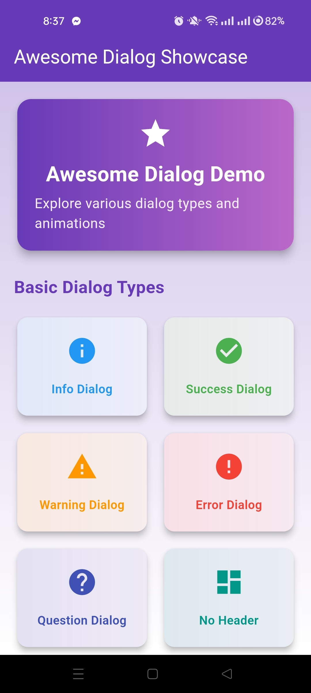
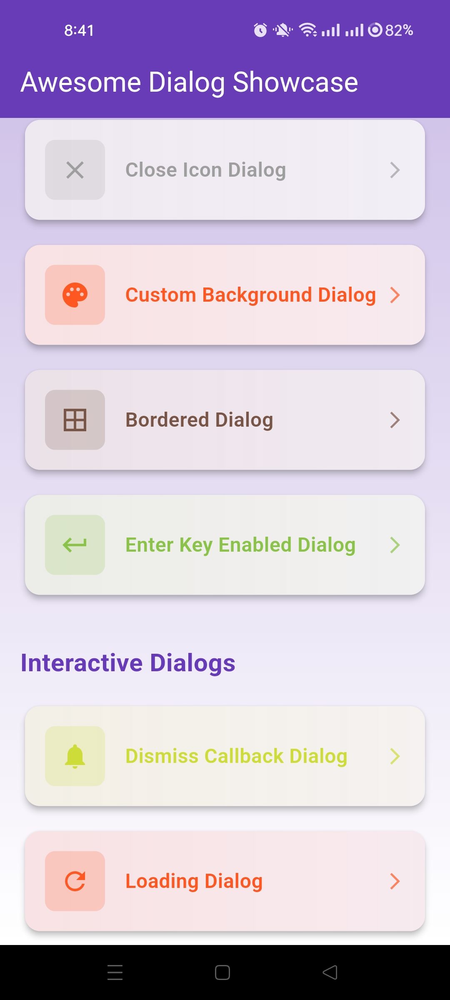
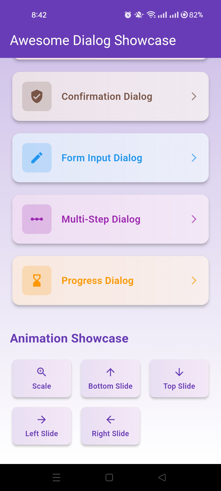
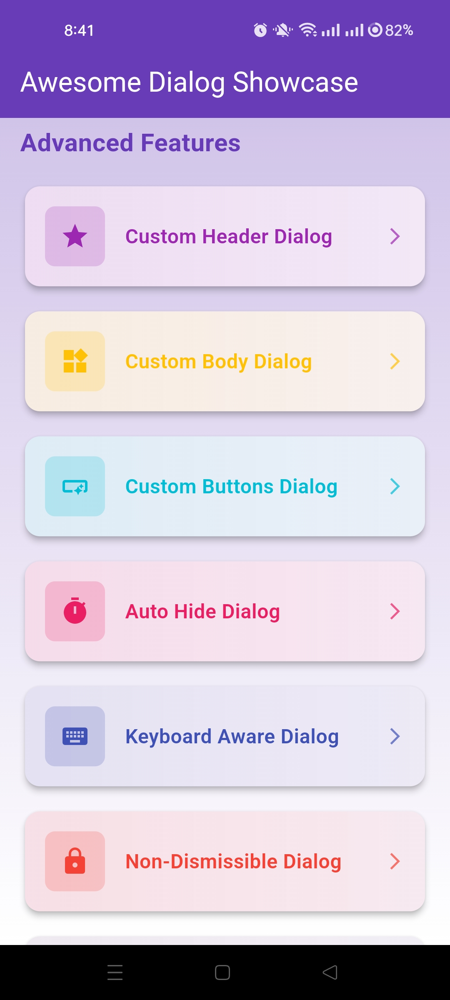
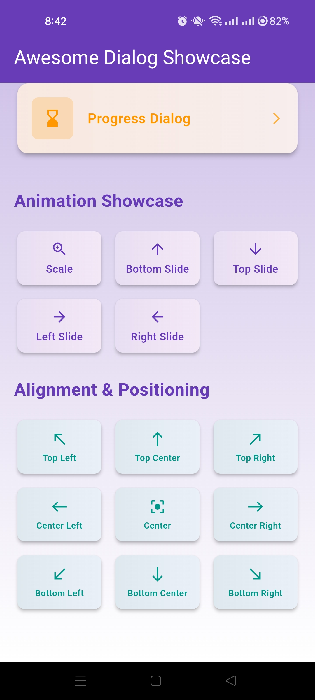

# 💬 Flutter Awesome Dialogs

[](https://flutter.dev)
[](https://dart.dev)
[]()
[]()
[](https://opensource.org/)

---

## 🎨 Overview

**Flutter Awesome Dialogs** is a **beautiful collection of custom dialog designs** that enhance user interaction through **visually appealing and intuitive interfaces** — featuring creative layouts, smooth animations, and straightforward implementations.

This project serves as a **comprehensive resource** for developers exploring advanced Flutter dialog design, custom UI components, and creating engaging user experiences with clarity and ease of use.

---

## 🎬 Preview
  
*Beautiful dialogs for better user experience*

<div align="left">
  <table>
    <tr>
      <td><video src="https://github.com/user-attachments/assets/36facb52-f282-4c8c-82b6-e791923c02d2" controls width="49%"></video></td>
      <td>  <video src="https://github.com/user-attachments/assets/5096d695-7ffe-4c77-9103-f9a38524bcb9" controls width="49%"></video></td>
      <td>  <video src="https://github.com/user-attachments/assets/1cdb2d69-2a05-4d1b-9f6a-645982a944c2" controls width="49%"></video></td>
      <td>  <video src="https://github.com/user-attachments/assets/70b6cbc0-5820-43ac-a3a5-77df8cabfc32" controls width="49%"></video></td>
    </tr>
  </table>
</div>


    


---

## ✨ Features

### 💬 **Dialog Collection**
* 🎨 **Multiple Dialog Types** — Success, error, warning, info, and custom designs
* 🎭 **Creative Layouts** — Unique and visually appealing dialog structures
* ✅ **Easy Integration** — Straightforward implementation for any project

### 🎨 **Stunning UI Design**
* 💎 **Modern Aesthetics** — Clean and contemporary dialog designs
* 🌈 **Vibrant Colors** — Eye-catching color schemes and gradients
* ✨ **Smooth Animations** — Fluid transitions and entrance effects
* 📱 **Responsive Design** — Adapts beautifully to different screen sizes

### 🚀 **Developer Friendly**
* 🧩 **Reusable Components** — Copy-paste ready dialog widgets
* 📚 **Well Documented** — Clear code structure and comments
* 🎯 **Customizable** — Easy to modify colors, text, and behavior

---

## 📸 Screenshots

<div align="left">
  <table>
    <tr>
      <td></td>
      <td></td>
      <td></td>
      <td></td>
      <td></td>
    </tr>
  </table>
</div>

---

## 🎥 Demo Video

Watch the **Awesome Dialogs** in action:
<div align="center">
<video src="https://github.com/user-attachments/assets/your-demo-video-id" controls width="100%" ></video> 
</div>


---

## 🏗️ Tech Stack

| Technology                          | Description                                          |
| ----------------------------------- | ---------------------------------------------------- |
| **Flutter**                         | Cross-platform framework for building beautiful apps |
| **Dart**                            | Core programming language powering Flutter apps      |
| **Custom Widgets**                  | Handcrafted dialog components for reusability        |
| **Material Design**                 | Modern design principles for intuitive interfaces    |

---

## ⚙️ Installation & Setup

Follow these steps to run the project locally:

### 1️⃣ Clone the Repository

```bash
git clone https://github.com/<your-username>/flutter-awesome-dialogs.git
cd flutter-awesome-dialogs
```

### 2️⃣ Install Dependencies

```bash
flutter pub get
```

### 3️⃣ Run the App

```bash
flutter run
```

---

## 💡 Learning Outcomes

By working with this project, you'll gain insights into:

* 💬 **Custom Dialog Design** — Creating beautiful and functional dialog widgets
* 🎨 **UI/UX Principles** — Implementing intuitive and clear user interfaces
* ✨ **Animation Techniques** — Adding smooth entrance and exit transitions
* 🧩 **Component Reusability** — Building modular and maintainable code
* 🎯 **User Interaction** — Enhancing user experience through thoughtful design


---

## 🤝 Contributing

Contributions are encouraged! If you'd like to enhance the design or functionality:

1. Fork the repository
2. Create a new branch (`git checkout -b feature/your-feature`)
3. Commit your changes (`git commit -m 'Add a new feature'`)
4. Push to the branch (`git push origin feature/your-feature`)
5. Open a Pull Request

---
🧠 Flutter Development Environment Setup

This project is built using Flutter. Below are the essential details and configuration requirements for replicating the development environment.

| Component              | Details                                      |
| ---------------------- | -------------------------------------------- |
| **Flutter Version**    | 3.27.1 (Stable Channel)                      |
| **Framework Revision** | 17025dd882                                   |
| **Engine Revision**    | cb4b5fff73                                   |
| **Dart Version**       | 3.6.0                                        |
| **DevTools Version**   | 2.40.2                                       |
| **Operating System**   | Windows 10 (Version 10.0.26200.6725, 64-bit) |
| **Locale**             | en-US                                        |


💻 Android Studio

* Version: 2023.3
* Java Runtime: OpenJDK 17 (17.0.10+0--11572160)

---

## 🤝 Contributing

Contributions are highly encouraged! Here's how you can help:

1. 🍴 **Fork** the repository
2. 🌿 **Create** a new branch (`git checkout -b feature/amazing-feature`)
3. 💾 **Commit** your changes (`git commit -m 'Add amazing feature'`)
4. 📤 **Push** to the branch (`git push origin feature/amazing-feature`)
5. 🎉 **Open** a Pull Request

---

## 💬 Connect & Support

For questions, feedback, or collaborations:

<div align="center">

[](https://github.com/PHom798)
[](https://x.com/KishanP07684084)
[](https://www.linkedin.com/in/hom-bdr-pathak-01a3bb210)
[](pathakhom17@gmail.com)

</div>

---

## 🌟 Show Your Support

If this project helped you or inspired your work:

<div align="center">

⭐ **Star this repository**  
🍴 **Fork it for your projects**  
📢 **Share with the Flutter community**  
💖 **Sponsor the development**  
🐛 **Report issues or suggest features**

</div>

---

## 📊 Project Stats

<div align="center">


</div>

---

<div align="center">

**Made with ❤️, Flutter, and 💬**

*Enhancing user interaction through beautiful dialogs*

### 💬 *"Clear Communication, Beautiful Design"* ✨

</div>
